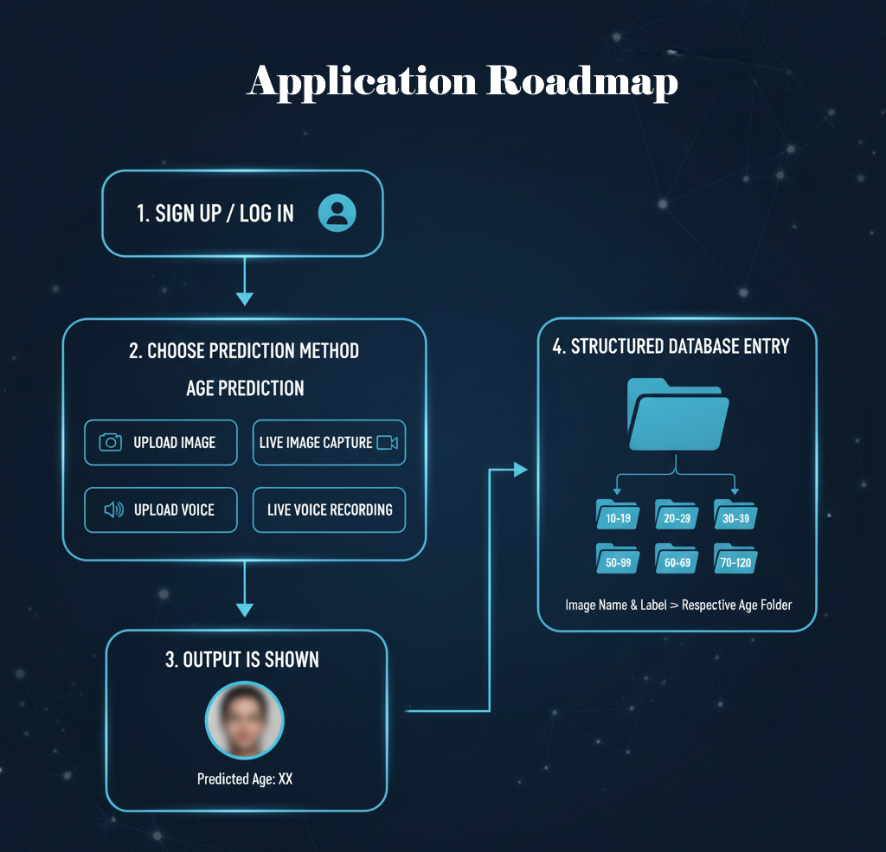

# Age Estimator - Multi-Modal Age Prediction System

A comprehensive age estimation system that uses both image and audio analysis to predict age groups. The system combines computer vision and audio processing techniques to provide accurate age predictions through multiple input modalities.



## Features

- **Image-based Age Prediction**: Upload images or use real-time camera feed for age estimation
- **Audio-based Age Prediction**: Upload audio files or record voice in real-time for age estimation
- **Multi-modal Analysis**: Combines both visual and audio cues for enhanced accuracy
- **Real-time Processing**: Live camera and microphone integration
- **Web Interface**: User-friendly dashboard with multiple input options
- **Batch Processing**: Support for multiple image/audio file uploads

## System Architecture

### Frontend
- HTML/CSS/JavaScript web interface
- Real-time camera and microphone access
- File upload capabilities
- Interactive dashboard

### Backend
- Flask-based REST API
- PyTorch models for image processing
- Scikit-learn models for audio processing
- CORS support for cross-origin requests

### Models
- **Image Model**: ResNet-18 based CNN trained on FairFace dataset
- **Audio Model**: MFCC feature extraction with machine learning classification

## Age Categories

The system classifies ages into the following groups:
- 0-2 years
- 3-9 years
- 10-19 years
- 20-29 years
- 30-39 years
- 40-49 years
- 50-59 years
- 60-69 years
- 70+ years

## Installation

### Prerequisites
- Python 3.8 or higher
- Web browser with camera/microphone access
- CUDA-compatible GPU (optional, for faster processing)

### Setup

1. **Clone the repository**
   ```bash
   git clone <repository-url>
   cd Hackathon-main
   ```

2. **Install Python dependencies**
   ```bash
   pip install -r requirements.txt
   ```

3. **Download pre-trained models**
   - Place the image model (`resnet_age_best.pth`) in the `backend/` directory
   - Place the audio models (`final_model.sav`, `scaler.sav`, `feature_selector.sav`, `label_encoder.sav`) in the `backend/` directory

## Usage

### Starting the Application

1. **Start the Backend Server**
   ```bash
   cd backend
   python app.py
   ```
   The backend will start on `http://localhost:5000`

2. **Open the Frontend**
   - Navigate to the `frontend/` directory
   - Open `dashboard.html` in a web browser
   - Or use the provided batch file: `start_backend.bat`

### Using the Interface

1. **Image Analysis**
   - Click "Upload Image" to select image files
   - Or click "Real-Time Face Detection" for live camera feed
   - The system will detect faces and predict age groups

2. **Audio Analysis**
   - Click "Upload Voice" to select audio files
   - Or click "Real-Time Voice Detection" to record live audio
   - The system will analyze voice characteristics to predict age

## API Endpoints

### Image Prediction
- **POST** `/predict`
- **Content-Type**: `multipart/form-data`
- **Parameters**: `file` (image file)
- **Response**: JSON with age predictions and processed image

### Audio Prediction
- **POST** `/predict_audio`
- **Content-Type**: `multipart/form-data`
- **Parameters**: `file` (audio file)
- **Response**: JSON with age group prediction

### Health Check
- **GET** `/`
- **Response**: Backend status and model availability

## Model Training

### Image Model Training

The image model is based on ResNet-18 architecture and can be trained using the FairFace dataset:

```bash
cd Training/image\ prediction/
python fairface_age_resnet.py \
  --data-root /path/to/FairFace \
  --train-csv annotations/fairface_label_train.csv \
  --val-csv annotations/fairface_label_val.csv \
  --epochs 12 --batch-size 64 --lr 1e-3 \
  --model-out output/resnet_age_best.pth
```

### Audio Model Training

The audio model uses MFCC features and can be trained using the provided Jupyter notebook:

```bash
cd Training/audio/
jupyter notebook Audio_model_training.ipynb
```

## File Structure

```
Hackathon-main/
├── backend/
│   ├── app.py                 # Flask backend server
│   ├── *.sav                  # Pre-trained audio models
│   └── resnet_age_best.pth    # Pre-trained image model
├── frontend/
│   ├── dashboard.html         # Main dashboard
│   ├── dashboard.js           # Frontend JavaScript
│   ├── style.css             # Styling
│   ├── assets/               # UI assets
│   └── start_backend.bat     # Windows startup script
├── Training/
│   ├── audio/
│   │   └── Audio_model_training.ipynb
│   └── image prediction/
│       ├── fairface_age_resnet.py
│       ├── live_age_prediction.py
│       ├── photo_age_prediction.py
│       └── run_*.py
└── requirements.txt          
```

## Technical Details

### Image Processing Pipeline
1. Face detection using OpenCV Haar Cascades
2. Face preprocessing and normalization
3. ResNet-18 feature extraction
4. Age classification into 9 categories
5. Confidence scoring and visualization

### Audio Processing Pipeline
1. Audio loading and preprocessing (5-second clips)
2. MFCC feature extraction (20 coefficients)
3. Spectral feature computation (centroid, bandwidth, rolloff)
4. Feature scaling and selection
5. Machine learning classification

### Performance Considerations
- GPU acceleration for image processing (when available)
- Efficient audio processing with librosa
- Optimized model loading and caching
- Real-time processing capabilities

## Troubleshooting

### Common Issues

1. **Backend Connection Failed**
   - Ensure Python dependencies are installed
   - Check if port 5000 is available
   - Verify model files are in the correct location

2. **Camera/Microphone Access Denied**
   - Enable camera/microphone permissions in browser
   - Use HTTPS for production deployment
   - Check browser compatibility

3. **Model Loading Errors**
   - Verify model files are not corrupted
   - Check Python version compatibility
   - Ensure sufficient memory for model loading

### Browser Compatibility
- Chrome 60+
- Firefox 55+
- Safari 11+
- Edge 79+

## Contributing

1. Fork the repository
2. Create a feature branch
3. Make your changes
4. Add tests if applicable
5. Submit a pull request

## License

This project is licensed under the MIT License - see the LICENSE file for details

## Acknowledgments

- FairFace dataset for image model training
- Mozilla Common Voice dataset for audio model training
- OpenCV for computer vision capabilities
- PyTorch and Scikit-learn for machine learning frameworks
